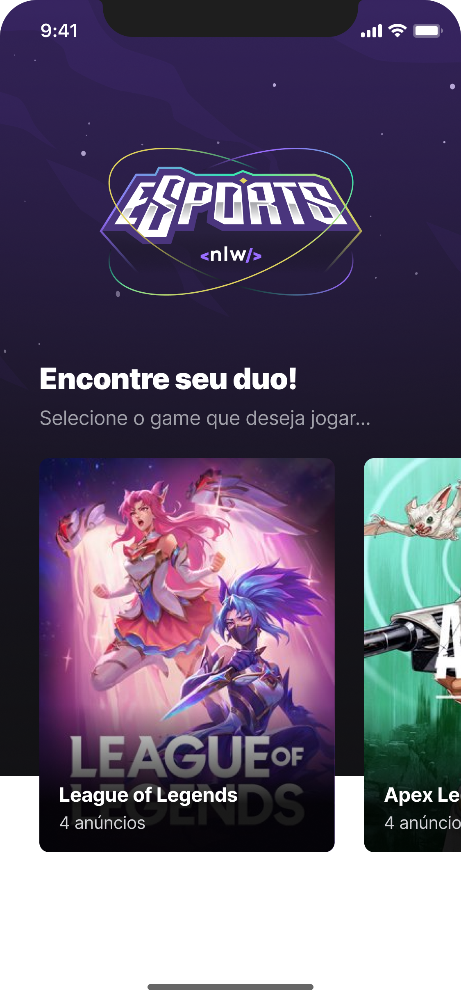

<div>
  
</div>

<br/>

## 📚 Versão Web do projeto

&nbsp;

<div>
  
  
</div>

## 📚 Versão Mobile do projeto

&nbsp;

<div>
  
  
  
</div>

## 📚 Informações sobre o projeto

- Esse projeto foi desenvolvido durante a NLW-09 da Rocketseat, Projeto full stack com seu próprio back-end, versão mobile e web.

&nbsp;

## 🖼️ Template do projeto Figma

- [Template do projeto original para clone](<https://www.figma.com/file/SoGCyBIVgMTM15RoBnFOuy/NLW-eSports-(Community)?node-id=6%3A23>)

<br/>

## 🛠️ Tecnologias/Ferramentas ultilizadas

## Web

- [react](https://pt-br.reactjs.org/)
- [vite](https://vitejs.dev/)
- [typescript](https://www.typescriptlang.org/)
- [tailwindcss](https://tailwindcss.com/)
- [phosphor-react](https://phosphoricons.com/)
- [@radix-ui/react-dialog](https://www.radix-ui.com/docs/primitives/components/dialog)
- [@radix-ui/react-select](https://www.radix-ui.com/docs/primitives/components/select)
- [@radix-ui/react-toggle-group](https://www.radix-ui.com/docs/primitives/components/toggle-group)

## Mobile

- [react](https://pt-br.reactjs.org/)
- [typescript](https://www.typescriptlang.org/)
- [react-native](https://reactnative.dev/)
- [expo](https://expo.dev/)
- [expo-font](https://docs.expo.dev/guides/using-nextjs/#font-support)
- [@expo-google-fonts/inter](https://expo.dev/)
- [expo-clipboard](https://expo.dev/)
- [expo-linear-gradient](https://expo.dev/)
- [expo-modules-core](https://expo.dev/)
- [expo-notifications](https://expo.dev/)
- [@react-navigation/native](https://reactnavigation.org/)
- [@react-navigation/native-stack](https://reactnavigation.org/docs/native-stack-navigator/)
- [expo-status-bar](https://expo.dev/)
- [phosphor-react-native](https://github.com/duongdev/phosphor-react-native)
- [react-native-screens](https://github.com/software-mansion/react-native-screens)
- [react-native-svg](https://github.com/react-native-svg/react-native-svg)
 
## NodeJS (Back-End)

- [NodeJS](https://nodejs.org/en/)
- [typescript](https://www.typescriptlang.org/)
- [express](https://expressjs.com/pt-br/)
- [cors](https://developer.mozilla.org/pt-BR/docs/Web/HTTP/CORS)
- [prisma](https://www.prisma.io/)
- [ts-node-dev](https://www.npmjs.com/package/ts-node-dev)

## ⚙️ Instalação

```
# Abra um terminal e copie este repositório com o comando
$ git clone https://github.com/Hugovarellaa/nlw-09
```

```
# Acesse a pasta da aplicação

# Instale as dependências
$ yarn

# Inicie a aplicação back-end
$ yarn dev

# Para ter ver o banco de dados do prisma
$ yarn prisma studio

# Inicie a aplicação web - mobile
$ yarn dev


```

---

<p align="center">Feito com 💙 por Hugo Alves Varella</p>
